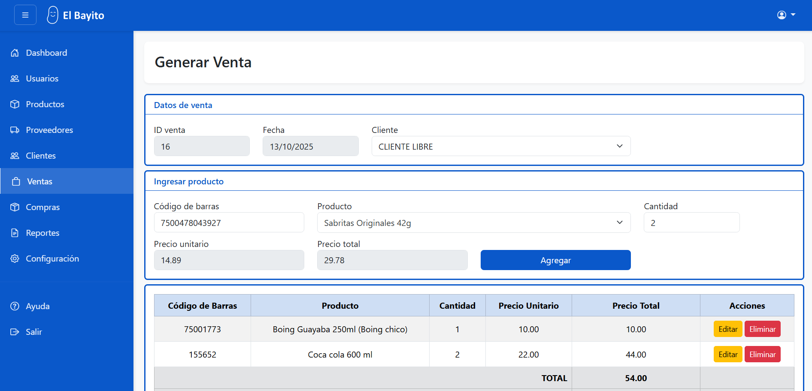

# Sistema de Ventas en PHP (MVC)

**Versión:** v1.0.0-beta.2
**Autor:** Jorge Ángel Sánchez Pérez  

Proyecto personal desarrollado en **PHP** siguiendo el patrón **Modelo-Vista-Controlador (MVC)**.  
El sistema permite gestionar ventas, productos, proveedores y clientes, además de emitir tickets de compra.  
Actualmente el sistema es funcional, aunque aún se están implementando módulos adicionales y mejoras.

---------------

## Características principales

- Gestión de **productos**, **proveedores** y **clientes**  
- Registro de **ventas** y generación de **tickets**  
- Control de **compras**  
- Roles de usuario con distintos niveles de acceso  
- Interfaz construida con **Bootstrap**  
- Conexión a base de datos mediante **PDO**

---------------

## En desarrollo (pendiente para versión final)

- Módulo de **reportes** detallados (ventas y compras)
- Panel de **administrador** para editar ventas/compras realizadas
- Módulo de **configuración general** (nombre de tienda, logo, dirección, teléfono)
- Mejoras de seguridad y control de permisos por rol

